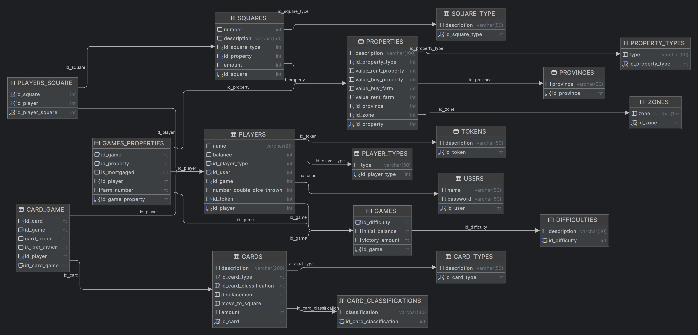

# TRABAJO PRACTICO INTEGRADOR LABORATORIO DE COMPUTACION III

## INTEGRANTES :

113838-Rodriguez, Fabrizio Enrique  
405847-Servetti Ribeiro, Bruno  
113855-Sanchez Solano, Ramiro  
114094-Di Bella, Pedro Agustin  
113928-Postillon, Joaquin  
113924-Postillon, Camila  
114142-Lentini, Franco

### Consigna Semana Uno.
Entregar un documento en formato markdown en el repositorio, en
la carpeta /docs, con todas las clases base detectadas como necesarias para
resolver el problema, con sus atributos, métodos y responsabilidades.
Entregar un modelo DER con todas sus entidades completas.

## CLASES BASES DETECTADAS PARA RESOLVER EL PROBLEMA.

| **_Clases_**               | **_Atributos_**                    | **_Metodos_**                             |
|----------------------------|------------------------------------|-------------------------------------------|
| **Game**                   | - gameId: int                      | - startGame()                             |
| (concrete Class)           | - difficulty: enum                 | - endGame()                               |
|                            | - victoryAmount: int               | - isFinished()                            |
|                            | - players: List&lt;Player&gt;      | - shuffleCards()                          |
|                            | - turn: int                        |                                           |
|                            |                                    |                                           |   
| **Board**                  | - squares: List &lt;Square&gt;     | - getChanceCard()                         |
| (concrete Class)           | - chanceCards: Queue &lt;Card&gt;  | - setChanceCard()                         |
|                            | - destinyCards: Queue &lt;Card&gt; | - getDestinyCard()                        |
|                            | - properties: Map&lt;Property&gt;  | - setDestinyCard()                        |
|                            |                                    | - createBoardInfo()                       |
|                            |                                    | - getProperty(int key)                    |
|                            |                                    |                                           |
|                            |                                    |                                           |
|                            |                                    |                                           |
|                            |                                    |                                           |
| **AbstractPlayer**         | - playerId: int                    | - buyProperty(Property p) (abstract)      |
| (abstract Class)           | - name: string                     | - mortgageProperty(Property p) (abstract) |
|                            | - balance: long                    | - rollDice() (abstract)                   |
|                            | - properties: List&lt;Property&gt; | - useCard()  (abstract)                   |
|                            | - cards: List&lt;Card&gt;          | -buyFarm()    (abstract)                  |
|                            | - currentSquare: Square            |                                           |
|                            |                                    |                                           |
| **Player**                 | -Strategy: strategy                | - buyProperty(Property p)                 |
| (concrete)                 |                                    | - mortgageProperty()                      |
|                            |                                    | - rollDice()                              |
|                            |                                    | - useCard()                               |
|                            |                                    | - setStrategy()                           |
|                            |                                    | - buyField()                              |
|                            |                                    |                                           |
|                            |                                    |                                           |
| **Strategy**               |                                    | -buyProperty()                            |
| (Abstract)                 |                                    | -buyField()                               |
|                            |                                    | -mortgageProperty()                       |
|                            |                                    | -useCard()                                |
|                            |                                    |                                           |
| **BalancedStrategy**       |                                    |                                           |
| (concrete BotPlayer)       |                                    |                                           |
|                            |                                    |                                           |
| **ConservativeStrategy**   |                                    |                                           |
| (concrete BotPlayer)       |                                    |                                           |
|                            |                                    |                                           |
| **HumanStrategy**          |                                    |                                           |
| (concrete Player)          |                                    |                                           |
|                            |                                    |                                           |
|                            |                                    |                                           |
|                            |                                    |                                           |                            
|                            |                                    |                                           |
| **AbstractSquare**         | -squareId                          | executeSquare() (abstract)                |
| (abstract Class)           |                                    |                                           |
|                            |                                    |                                           |
| **DestinySquare**          |                                    |                                           |
| (concrete Square)          |                                    |                                           |
|                            |                                    |                                           |
| **LuckSquare**             |                                    |                                           |
| (concrete Square )         |                                    |                                           |
|                            |                                    |                                           |
| **PropertySquare**         |                                    |                                           |
| (abstract Square)          |                                    | chargeRent(Player p) (abstract)           |
|                            |                                    |                                           |
| **FieldPropertySquare**    |                                    | chargeRent(Player p)                      |
| (concrete PropertySquare)  |                                    |                                           |
|                            |                                    |                                           |
| **CompanyPropertySquare**  |                                    | chargeRent(Player p)                      |
| (concrete PropertySquare)  |                                    |                                           |
|                            |                                    |                                           |
| **RailroadPropertySquare** |                                    | chargeRent(Player p)                      |
| (concrete PropertySquare)  |                                    |                                           |
|                            |                                    |                                           |
| **PrizePenaltySquare**     | -prizePenaltyAmount                | -giveMoneyToPlayer(Player p)              |
| (concrete Square)          |                                    |                                           |
|                            |                                    |                                           |
| **StartingSquare**         |                                    |                                           |
| (concrete Square)          |                                    |                                           | 
|                            |                                    |                                           |
| **RestSquare**             |                                    |                                           |
| (concrete Square)          |                                    |                                           |
|                            |                                    |                                           |
| **FreeParkingSquare**      |                                    |                                           |
| (concrete Square)          |                                    |                                           |
|                            |                                    |                                           |
| **GoToJailSquare**         |                                    |                                           |
| (concrete Square)          |                                    |                                           |
|                            |                                    |                                           |
| **JailSquare**             |                                    |                                           |
| (concrete Square)          |                                    |                                           |
|                            |                                    |                                           |
| **AbstractProperty**       | - propertyId: int                  | calculateRent() (abstract)                |
| (abstract Class)           | - propertyValue: int               |                                           |
|                            | - rentValue: int                   |                                           |
|                            | - owner: Player                    |                                           |
|                            | - propertyTypeId: int              |                                           |
|                            |                                    |                                           |
| **FieldProperty**          | - farmQuantity: int    (chacra)    | calculateRent()                           |
| (concrete                  | - farmPurchaseValue: int           |                                           |
| Property)                  | - ranchPurchaseValue: int          |                                           |
|                            | - ranchRentValue: int  (estancia)  |                                           |
|                            | - farmRentValue: int               |                                           |
|                            | - provinceId: String               |                                           |
|                            | - zoneId: String                   |                                           |
|                            |                                    |                                           |
| **RailroadProperty**       | - railroadId: int                  | calculateRent()                           |
| (concrete                  |                                    |                                           |
| Property)                  |                                    |                                           |
|                            |                                    |                                           |
| **CompanyProperty**        | - companyId: int                   | calculateRent()                           |
| (concrete                  |                                    |                                           |
| Property)                  |                                    |                                           |
|                            |                                    |                                           |
| **Dice**                   | - doubleDice: int                  | addDice()                                 |
| (concrete Class)           | - dieOne: int                      |                                           |
|                            | - dieTwo: int                      |                                           |
|                            |                                    |                                           |
| **AbstractCard**           | - cardId: int                      | executeCard() (abstract)                  |
| (abstract Class)           | - cardType: int                    |                                           |
|                            | - cardDescription: string          |                                           |
|                            |                                    |                                           |
| **GoToSquareCard**         | - SquareId: int                    | executeCard()                             |
| (concrete Card)            | - earnfiveThousand: boolean        |                                           |
|                            |                                    |                                           |
| **OutOfJailCard**          |                                    | executeCard()                             |
| (concrete Card)            |                                    |                                           |
|                            |                                    |                                           |
| **DisplacementCard**       | - displacement: int                | executeCard()                             |
| (concrete Card)            |                                    |                                           |
|                            |                                    |                                           |
| **PrizePenaltyCard**       | -penaltyPrizeAmount: int           | executeCard()                             |
| (concrete Card)            |                                    |                                           |
|                            |                                    |                                           |
| **FarmPenaltyCard**        |                                    | executeCard()                             |
| (concrete Card)            | -penaltyPerFarm: int               |                                           |
|                            |
| **PrizePerPlayerCard**     | -pricePerPlayer: int               | executeCard()                             |
| (concrete Card)            |                                    |                                           |

## Responsabilidad de cada Metodo por Clase :
### Clase Juego :
### Metodos
    startGame() = este metodo permite inicializar un nuevo juego de estanciero.
 
     saveGame() = este metodo permite guardar la partida . 
    
    endGame() = este metodo permite terminar la sesion de juego del jugador.
    
    -shuffleCards() = este metodo genera tarjetas al azar es decir mezclandolas.

    - giveCard() = este metodo otorga una tarjeta al jugador/bot correspondiente. 

### Clase tablero :
### Metodos:
    - getChanceCard()= Recupera la tarjeta suerte que esta primera de la fila y la saca
    
    -setChanceCard() = Inserta una tarjeta suerte al final de la fila
    
    -getDestinityCard() = Recupera una tarjeta destino que esta primera en la fila
    
    -getDestinyCard() = Inserta una tarjeta Destino al final de la fila.

    - createBoardInfo() = Buscara la informacion correspondiente a la configuracion del jeugo para crear las listas de cards, properties y square.

    -getProperty(int key) = Recupera una Propiedad de la lista Property y para asignarsela a un jugador.
### Clase Jugador :
### Metodos
    -buyProperty()   = este metodo permite comprar una propiedad de ser posible.

    - mortgageProperty()  = este metodo permite hipotecar la propiedad de ser posible.

    - rollDice()  = este metodo genera un random de dos dados los cuales seran utilizados para calcular la posicion de movimiento.

   
    -useCard() = este metodo permite al jugador usar una tarjeta que tenga en su posesion.  
    
    -pay() = este metodo permite al jugador pagar de forma general.

### Clase Bot
### Metodos

    - buyProperty() = este metodo permite comprar una propiedad de ser posible.

    - mortgageProperty() = este metodo permite hipotecar la propiedad de ser posible.

    - rollDice()= este metodo genera un random de dos dados los cuales seran utilizados para calcular la posicion de movimiento.

    - useCard()  = este metodo permite al bot usar una tarjeta que tenga en su posesion.

    -pay() = este metodo permite al bot pagar de forma general.

### Clase Tablero
### Metodos
    -shuffleCards() = este metodo genera tarjetas al azar es decir mezclandolas.

    - giveCard() = este metodo otorga una tarjeta al jugador/bot correspondiente.  

### Clase Propiedad
### Metodos
    -calculateRent()  = este metodo calcula el alquiler total de la propidad.
### Clase Square
### Metodos

    -chargeRent() = en las casilla propiedades se encarga de cobrar alquileres.

### Clase Dado
### Metodos

    -addDice() = este metodo utiliza los dados generados de forma al azar y suma el numero del dadoUno y el dadoDos para generar un resultado.  

### Clase Tarjeta
### Metodos

    -executeCard() = es un metodo general de la clase tarjeta dependera de si la tarjeta es general , beneficio , castigo o carcel . 

## DIAGRAMA DE ENTIDAD RELACION 

