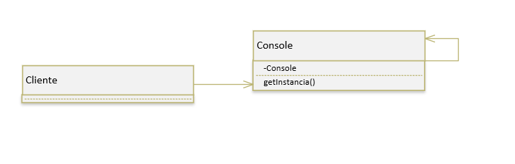
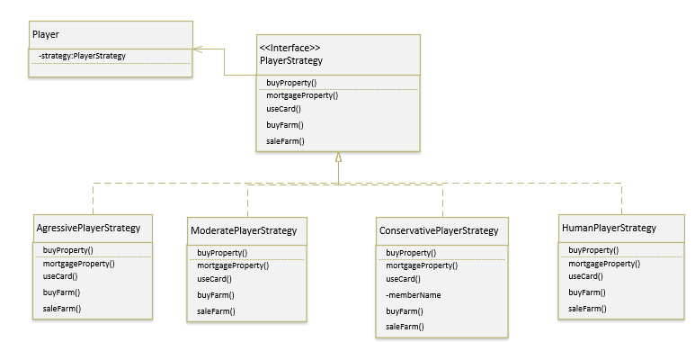
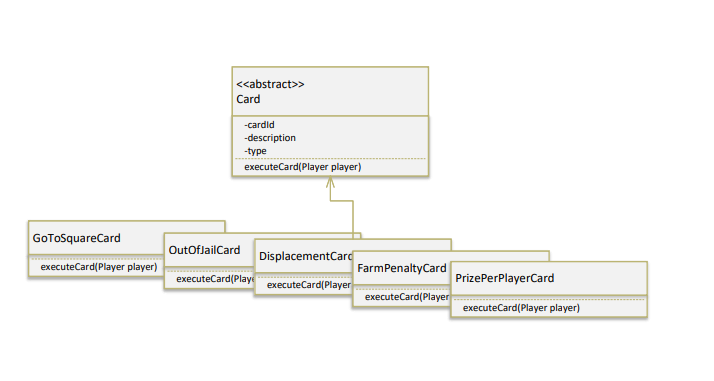
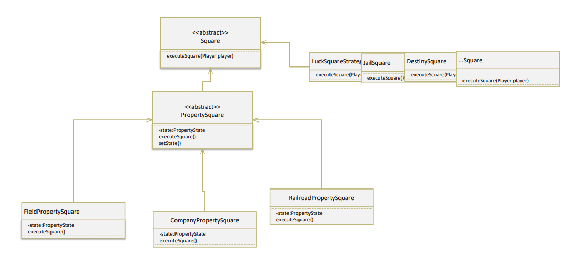
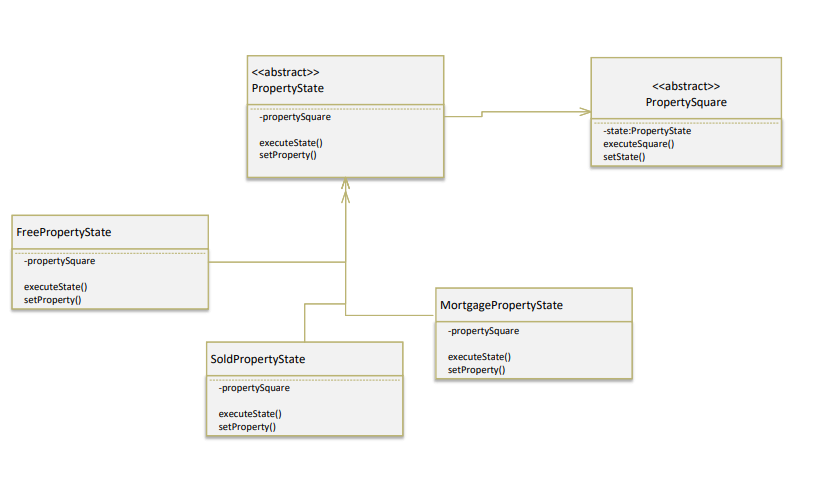
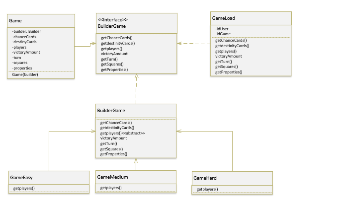

# TRABAJO PRACTICO INTEGRADOR LABORATORIO DE COMPUTACION III

## INTEGRANTES :

113838-Rodriguez, Fabrizio Enrique  
405847-Servetti Ribeiro, Bruno  
113855-Sanchez Solano, Ramiro  
114094-Di Bella, Pedro Agustin  
113928-Postillon, Joaquin  
113924-Postillon, Camila  
114142-Lentini, Franco

## Consigna Semana Cinco.

    Entregar un documento en formato markdown en el repositorio, en
    la carpeta /docs, con los patrones de diseño que se pretenden utilizar con su
    explicación de porqué seleccionaron dicho patrón y qué problema pretende
    resolver.

## Patterns 
### Factory
    Usaremos este patron para la creacion de diferentes clases, estas son: 
    BotPlayer, todos los tipos de Squares, Properties y Cards.
    Elegimos este patrón para solucionar el problema de crear muchos objetos de la misma clase

### Singleton
    Usaremos este patrón para crear una sola instancia de la clase Console, dado y tablero.
    En particular el objetivo de que el tablero sea una unica instancia es mantener consistente 
    la informacion del juego que distintas situaciones y eventos la necesiten acceder.
    ej:

### Strategy
    Las clases que implementeran este patron son los bots.
    Este patron se va a aplicar en los jugadores, ya que al mismo mensaje se le debera responder
    de distinta forma dependiendo la clase del jugador. Se implementara para aquellos
    metodos donde haya una toma de desición.

    
### Template Method
    El patron viene a solucionar la posibilidad de que muchas subclases puedan tener una misma secuencia
    de pasos y subscribir dichos pasos. Este patron se va a aplicar a las Square. 

### State
    El State nos proporciona la posibilidad de alterar un comportamiento de una clase dependiendo el 
    estado que tenga, Este patron nos permite manejar los estados de las propiedades e implementar 
    un comportamiento diferente dependiendo si esta free, sold o Mortgage.

### Builder
    El patron de diseño Builder nos proporciona una solucion en la creacion de los juegos. Este patron
    es utilizado para solucionar la construccion de objetos complejos utilizando el mismo codigo de
    construccion. El objetivo de esta implementacion es poder construir las distintas dificultades del 
    juego o cargar una partida guardada

    
