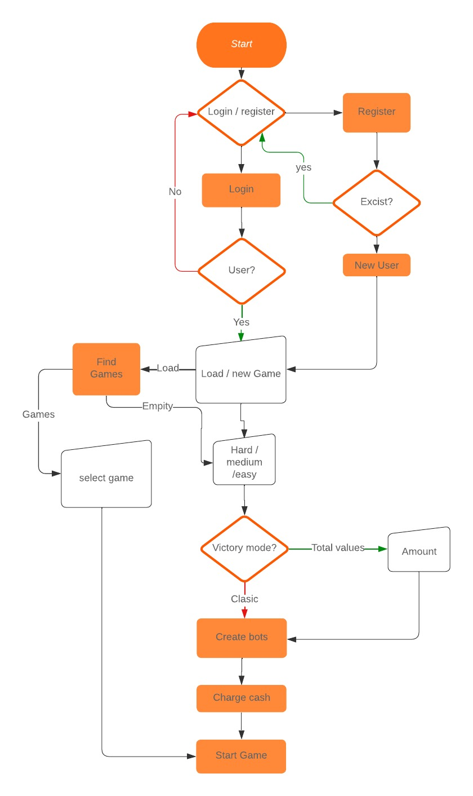
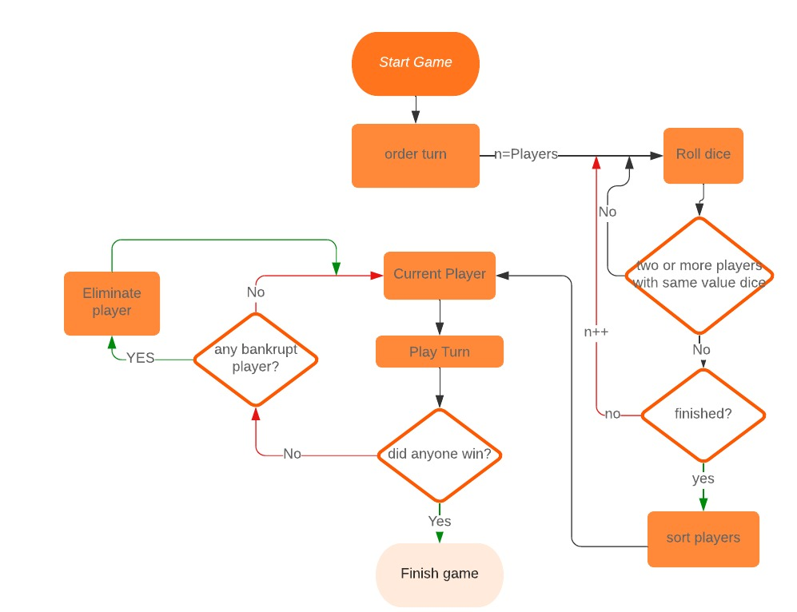
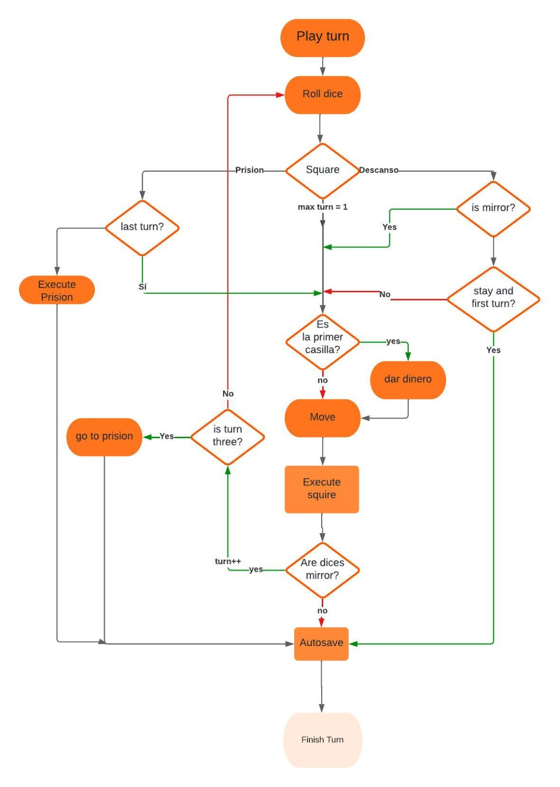
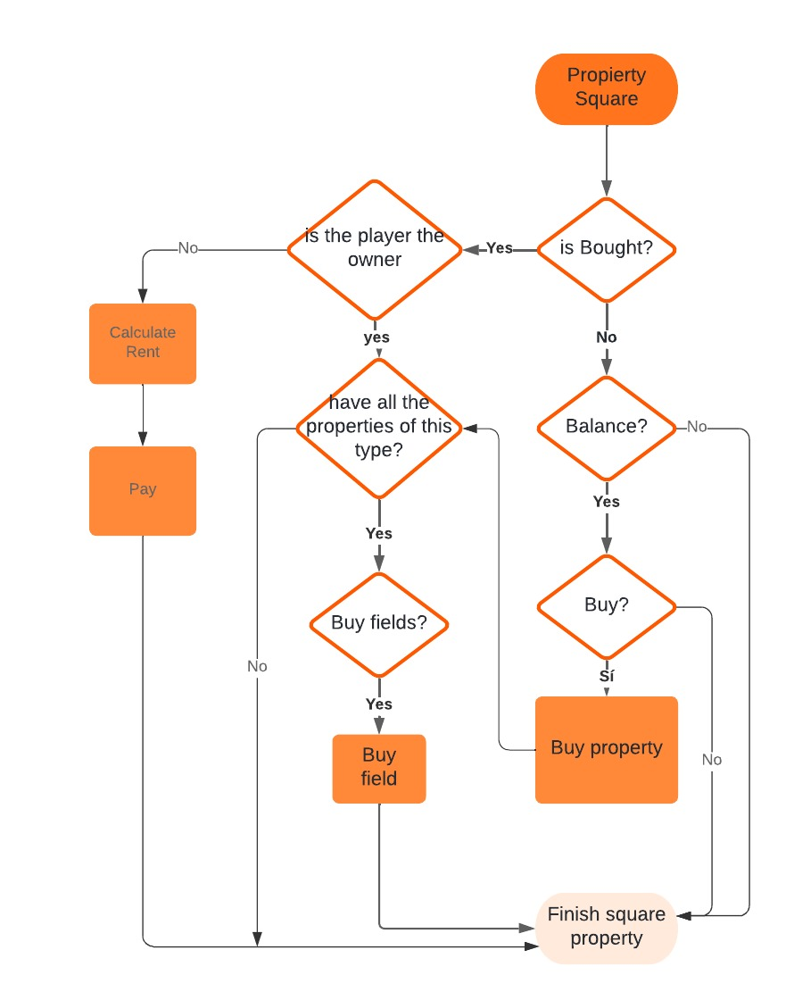

# TRABAJO PRACTICO INTEGRADOR LABORATORIO DE COMPUTACION III

## INTEGRANTES :

113838-Rodriguez, Fabrizio Enrique  
405847-Servetti Ribeiro, Bruno  
113855-Sanchez Solano, Ramiro  
114094-Di Bella, Pedro Agustin  
113928-Postillon, Joaquin  
113924-Postillon, Camila  
114142-Lentini, Franco

### Consigna Semana Dos.

    Entregar un documento en formato markdown en el repositorio, en 
    la carpeta /docs, con la explicación de la experiencia de usuario que se 
    desarrollará, incluyendo los menús de navegación, acciones, eventos y 
    presentaciones que se usarán.

### Experiencia de usuario.

    El objetivo del software es jugar al Estanciero a traves de la interaccion por consola. 
    Los usuarios tendran una seguidilla de instrucciones donde tendran que ingresar parametros para la toma de desiciones en el juego. 

## Menu

    Al comienzo del software se solicitara usuario y contraseña  o la opcion de registrarse.

| **_evento_**       | **_output_**                          | **_Comando Input_**          |
|--------------------|------------------------------------|---------------------------------|
| **`Login`**     |   -" ingrese usuario" - "ingrese contraseña" |   user-Password          |
| **`Register`**     |  -"ingrese usuario" - "ingrese contraseña" - "ingrese nombre completo"| user-Password - Nombre|
| **`New Game`**    | - "Para comenzar una nuevar partida  ingrese new"  |     New            |
| **`Load Game`**   | - "Para un cargar una partida ingrese load"       |       Load        |
| **`Logout`**      | - "¿Desea cerrar sesion? ingrese Logout "|Logout  |
| **`Game Options `** | -"Seleccione la dificultad: Easy-Medium-Hard"   |      Easy/Medium/Hard  |
| **`Select Game`** |  -"ingrese el numero de la partida"              |      1 - 2 - 3 - 4... |
| **`Options Victory`** |  -"¿Desea activar el modo victoria por valores totales? ingrese Yes o No" |      Yes/no |
| **`Enter the Amount`** |  -"Ingrese le monto de victoria debe ser mayor a 50000" |    (int) |

    Login: da inicio de sesion, se valida por base de datos usuario y contraseña. en caso de negarse se solicita devuelta con un mensaje "usuario o contraseña incorrecta"

    Register: Solicita usuario, contraseña y nombre para dar inicio a la sesion y registro de nuevo usuario, se validara usuario unico por base de datos. 
 
## Opciones despues del login: 

    New Game: Habilita a la seccion de opciones de dificultad. 

    Load Game: busca las partidas asociadas a ese usuario y las itera, para poder seleccionarlas por orden asignado, mostrando el nombre de la partida en que se guardo.

    Logout: cierra sesion, habilitara dos opciones para confiramr, Yes/No. No regresa al menu, Yes vuelve al login. 

## Opciones despues de new Game:

    Select Game Mode: Brindara tres opciones de dificultad: easy - medium - hard. Una vez seleccionada la opcion dara inicio al juego. 

## Opciones despues del Select Game Mode

    Options Victory: Da opcion del modo victoria por monto. habilita el ingreso de la cantidad de monto, si es no, guardara la configuracion en la base de datos. 

    Enter the Amount: Ingreso de la cantidad de monto para ganar, con validaciones. Luego guardara la configuracion en la base de datos

## -opciones despues load Game:

    Select Game: Seleccionara la partida que quiera cargar. Dando inicio al juego desde el lugar guardado. 

## Game

| **_evento_**               | **_output_**                                                                                                                                                               | **_Comando Input_**            |
|----------------------------|----------------------------------------------------------------------------------------------------------------------------------------------------------------------------|--------------------------------|
| **`Select turn`**          | -"Nombre de jugador: numero que salio"                                                                                                                                     |                                |
| **`Player turn`**          | -"El jugador (player) saco (valor)"                                                                                                                                        |                                |
| **`Landed on the Square`** | -"El jugador (player) cayo en la casilla (numero, descripcion)"                                                                                                            |                                |
| **`Buy`**                  | "¿Desea comprar la Casilla (descripcion), que vale (monto)? yes o no"                                                                                                      | yes/no                         |
| **`PrisonSquare`**         | "Cayó en la carcel ,El jugador (player) debe pagar 1000 , en caso de no poder debera sacar dobles en los dados o utilizar la carta de Suerte o Destino si es que la tiene" | yes/no                         |
| **`Lucky Square`**         | "El jugador (player) Cayó en la casilla suerte, recibe una tarjeta de suerte: (descripcion)"                                                                               |                                |
| **`Destiny Square`**       | "El jugador (player) Cayó en la casilla destino, recibe una tarjeta de destino: (descripcion)"                                                                             |                                |
| **`Starting Square`**      | " El jugador (player) Paso por el inicio del tablero , recibe una bonificacion : (5000)"                                                                                   |                                |                                                                                             
| **`FreeParking`**          | "El jugador cayo en la casilla libre estacionamiento , debera volver a girar los dados ya que no puede permanecer ahi"                                                     |                                |
| **`Prize`**                | "El jugador (player) gano 2500 por caer en la casilla premio"                                                                                                              |                                |
| **`RestSquare`**           | "El jugador (player) tiene derecho , si asi lo desea , de quedarse por dos turnos , desea quedarse?"                                                                       | yes/no                         |
| **`GoToJail`**             | "El jugador (player) debe moverse a la casilla de comisaria (prison) "                                                                                                     |                                |
| **`Pay`**                  | Caiste en (propiedad)  con dueño,  paga a (player) el monto de (Alquiler) "                                                                                                |                                |
| **`NoCash`**               | "El jugador (jugador) no tiene efectivo ,debe (saldoDeudor) , elija propiedad a hipotecar , vender chacras (descripcion propiedades) "                                     | elegirHipotecar o vender (1-2) |
| **`Mortgage`**             | "Seleccione una propiedad para Hipotecar : (lista de propiedades a hipotecar)                                                                                              |  (1-2-3-4-5-....)  |
| **`SellFarm`**             | "Seleccione una propiedad  para vender sus chacras o estancias : (lista de propiedades con chacras)"                                          | (1-2-3-4-5-...) / (cantidad disponible para vender 1-4)|

## Eventos despues de inicio juego

    Select turn: Los jugadores lanzaran sus dados y dependiendo el valor se asignaran los turnos (descendente).

    Player turn: Dara comienzo del turno: ejecutando dados y moviendo al casillero excepto que este en la casilla prison, 
                solo se movera si pasa 3 turnos o si los dos dados sacaron el mismo valor.

    Landed on the Square: Descripcion de la casilla, ejecuta la casilla para dar las distintas opciones dependiendo la clase

## Eventos posibles despues de caer en casilla:  
    Buy: El jugador toma la desicion de comprar la casilla, se le asigna dueño a la casilla.

    Prison Square: Ejecuta la casilla prision, el jugador pierde 3 turnos. 

    Lucky Square: Se le asigna una tarjeta de la lista de tarjetas. posibles opciones: auto Ejecutarse, puede guardarla, decidir ejecutarla. 

    Destiny Square: Se le asigna una tarjeta de la lista de tarjetas. posibles opciones: auto Ejecutarse, puede guardarla, decidir ejecutarla. 

    Starting Square: Por cada vuelta en que se cruce la casilla de inicio el jugador recibira una bonificacion de 5000 como recompenza.

    Free Parking: Se activara el evento RollDices para que el jugador salga de esta casilla , ya que no puede permanecer en ella.

    Prize Square: Se le otorgara al jugador un beneficio de 2500 por caer en esta casilla.

    Rest Square: Al llegar a esta casilla , cuando sea el nuevo turno del jugador , este podra si asi lo desea quedarse por dos turnos,
                siempre que no saque doble en los dados. se activara RollDices automaticamente

    Go To Jail: El jugador se redirecciona a la casilla de comisaria (Prison) automaticamente. se ejecutara de forma automatica el evento Prison.

    Pay: El jugador cayo en una propiedad con dueño debera pagar el alquiler . si no hay saldo de dinero se ejecuta automaticamente el evento NoCash. (vease NoCash)

    NoCash: El jugador no tiene dinero debera elegir entre Hipotecar  propiedades sin chacras(lease Mortgage), o vender chacras (vease SellFarm).

    Mortgage: En caso de tener Propiedades sin hipotecar y sin chacras se mostrara una lista de ellas. El jugador podra decidir cual Hipotecar.

    SellFarm: En caso de tener Propiedades con chacras o estancias se mostrara una lista de ellas . El jugador podra decidir  la cantidad y cuales vender.

## Diagrama de flujo de turnos

## Diagrama de flujo de propiedades

